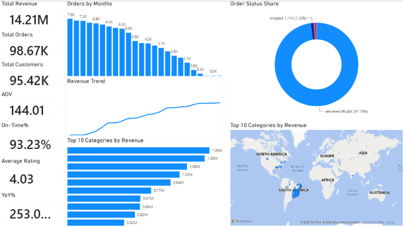
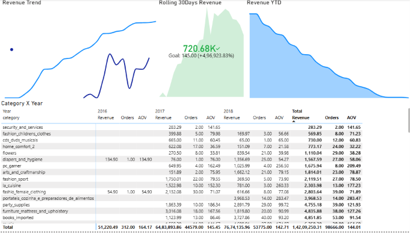
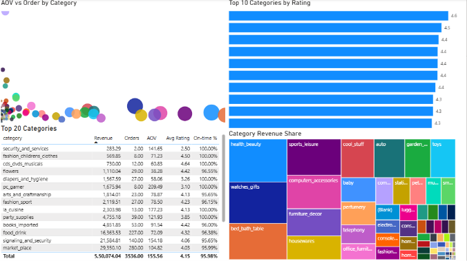
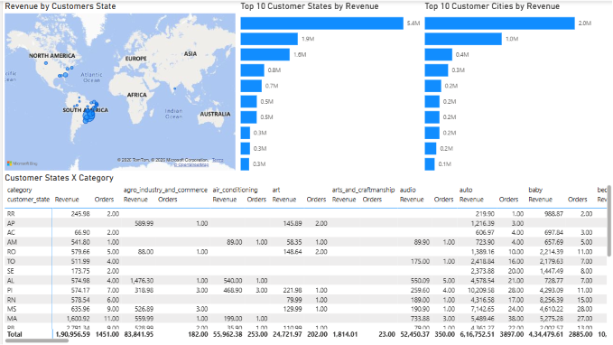
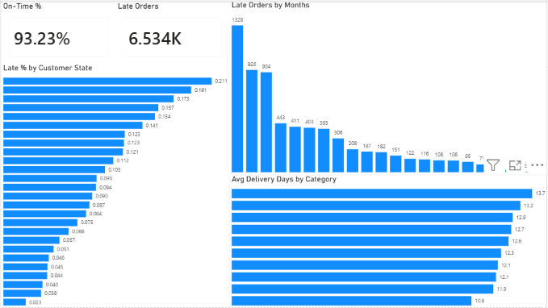
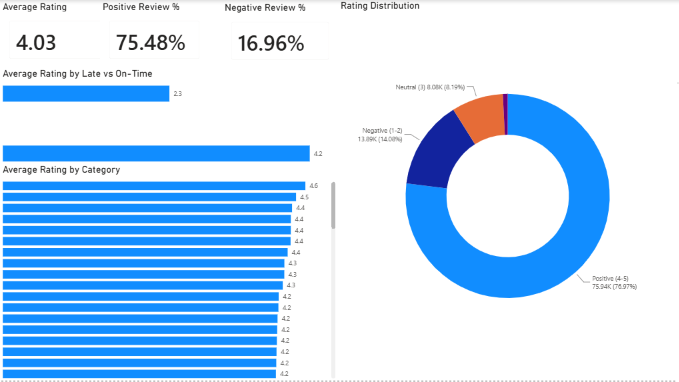
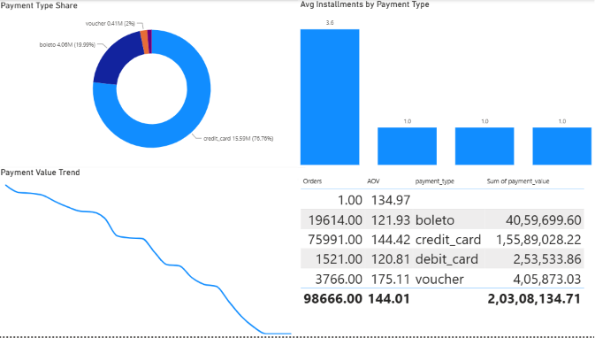
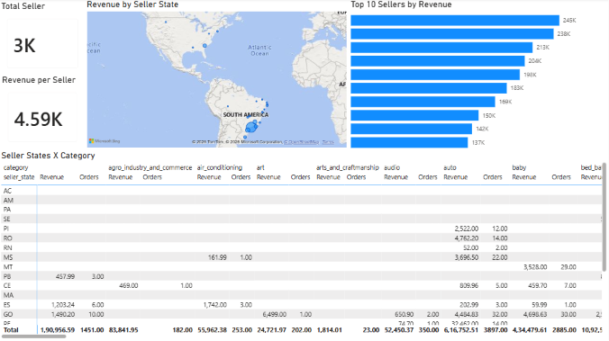
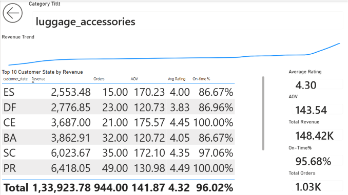

# 📊 Olist E-Commerce Analytics Dashboard

An end-to-end **Business Intelligence** project built using **PostgreSQL**, **Power BI**, and **DAX** to analyze the Olist Brazilian E-Commerce dataset. The project demonstrates the complete BI workflow—from database design and SQL queries to interactive dashboards and KPI reporting.

---

## 📌 Project Overview

This project showcases:

- Database design in PostgreSQL
- SQL data preparation and transformation
- Star schema data modeling
- Power BI dashboard development
- Advanced DAX measures and KPIs
- Interactive visualizations with drillthrough analysis

---

## 🛠️ Tech Stack

- PostgreSQL
- SQL
- Power BI
- DAX
- Data Modeling
- Business Intelligence

---

## 🗄️ Database

The PostgreSQL database consists of the following datasets:

- Customers
- Orders
- Order Items
- Products
- Sellers
- Payments
- Reviews
- Geolocation
- Product Category Translation

The database includes:

- Foreign Key Relationships
- BI Fact & Dimension Views
- Optimized SQL Queries

---

## 📊 Dashboard Pages

### 1. Executive Dashboard
- Revenue Overview
- Orders
- Customers
- Average Order Value
- Gross Merchandise Value
- Interactive Filters

### 2. Sales Trends
- Revenue Trend
- Revenue YTD
- Revenue Last Year
- YoY Growth
- Rolling 30-Day Revenue

### 3. Category & Product Analysis
- Category Performance
- Product Sales
- Revenue by Category

### 4. Customer Geography
- Customer Distribution
- Geographic Sales Analysis
- State-wise Performance

### 5. Delivery & Logistics
- Delivery Days
- Late Deliveries
- On-Time Delivery %
- Logistics Performance

### 6. Reviews Analysis
- Average Rating
- Positive Reviews
- Negative Reviews
- Review Distribution

### 7. Payment Analysis
- Payment Value
- Installments
- Payment Type Analysis

### 8. Seller Analysis
- Revenue by Seller
- Seller Performance
- Top Sellers

### 9. Drillthrough Analysis
- Detailed Product & Sales Analysis

---

## 📈 Key Performance Indicators (KPIs)

The dashboard includes dynamic DAX measures such as:

- Revenue
- Gross Merchandise Value (GMV)
- Orders
- Customers
- Items Sold
- Average Order Value (AOV)
- Revenue YTD
- Revenue Last Year
- Year-over-Year Growth %
- Rolling 30-Day Revenue
- Positive Review %
- Negative Review %
- Average Rating
- Delivered Orders
- Late Orders
- On-Time Delivery %
- Revenue per Seller
- Payment Value
- Average Delivery Days
- Average Installments

---

## 📂 Repository Structure

```text
Olist-Ecommerce-Analytics/
│
├── README.md
├── Olist-Ecommerce-Analytics_powerbi.pbix
│
├── SQL/
│   └── Olist_sql_queries.sql
│
└── Dashboard_screenshots/
    ├── 01_Executive_Dashboard.png
    ├── 02_Sales_Trends.png
    ├── 03_Category_Product.png
    ├── 04_Customer_Geo.png
    ├── 05_Delivery_Logistics.png
    ├── 06_Reviews.png
    ├── 07_Payments.png
    ├── 08_Seller.png
    └── 09_Drillthrough.png
```

---

## 🔗 Power BI Connection

The Power BI report uses **DirectQuery** to connect to a local PostgreSQL database.

**Database Details**

- Database: `olist_db`
- Connection Mode: **DirectQuery**

> **Note:** The PBIX file contains the report design, DAX measures, and connection configuration. To interact with the report using live data, configure the PostgreSQL connection on your local machine.

---

## 💡 Skills Demonstrated

- SQL Query Writing
- PostgreSQL Database Design
- Data Modeling
- Star Schema
- Power BI Dashboard Development
- DAX Calculations
- Business Intelligence
- KPI Development
- Data Visualization
- Interactive Reporting

---

# 📸 Dashboard Preview

## 1. Executive Dashboard



---

## 2. Sales Trends



---

## 3. Category & Product Analysis



---

## 4. Customer Geography



---

## 5. Delivery & Logistics



---

## 6. Reviews Analysis



---

## 7. Payment Analysis



---

## 8. Seller Analysis



---

## 9. Drillthrough Analysis



---

## 🚀 Future Enhancements

- Publish the report to Power BI Service
- Add Row-Level Security (RLS)
- Create real-time dashboards
- Optimize DAX measures for large datasets
- Build executive scorecards

---

## 👤 Author

**Zeeshan Ahmad**

B.Tech Computer Science Engineering

GitHub: https://github.com/zeeshanptn

---

⭐ If you found this project interesting, consider giving it a star!

